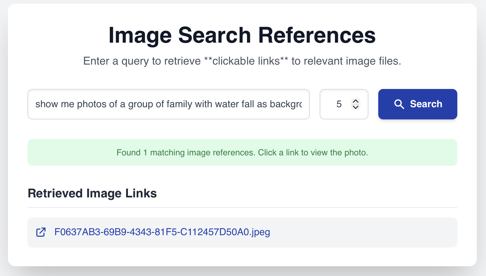

# 📸 Intelligent Image Finder: Search Photos by Meaning, Not by Manual Tags

## 📸 Image and Metadata Preparation

* **Image Extraction (Optional):** Photos are optionally extracted from the **Apple Photo Library** using the `osxphotos` tool. The extraction process converts photos to **JPEG** format (`--convert-to-jpeg`), ensuring **high quality** (`--jpeg-quality 1.0`), and correcting orientation. **(see extract_images.sh script)**
* **Descriptive Document Generation:**
    * A **Vision Model** (specifically **gemma3:12b-it-qat**) is used to generate a **descriptive text file** for each JPEG image.
    * **EXIF metadata** (including **creation date** and **GPS location**) is appended to the descriptive text file. **(see process_images.sh script)**

***

## 💾 Document Storage and Search Indexing

* **Embedding Generation:** **Vector embeddings** for each descriptive text file (including the appended EXIF data) are generated using the **mxbai-embed-large LLM**.
* **Vector Storage:** The resulting vector embeddings are stored in a **Vector Store**, specifically **Postgres with the PGVector extension**.

***

## 🔎 User Request Processing

* **Semantic Search:** A **semantic search** is performed on the **Postgres PGVector** database to retrieve relevant image references.
* **Retrieval Criterion:** Image references are retrieved if they are **no more than 60 degrees apart** (a vector similarity threshold) from the user's query vector.
* **Output Format:** The final result is a **clickable, ordered list of image references (hrefs)**.

